# EP-133 K.O. II

## Programs

Backups at [ipns://k51qzi5uqu5dgmnb25n6li2414auwyf4x7cluowbhlzn4c6x0abdy222xu42ej](http://ipfs.io/ipns/k51qzi5uqu5dgmnb25n6li2414auwyf4x7cluowbhlzn4c6x0abdy222xu42ej).

### `P06`: Early music

| Pattern | Name                                                                                | Signature | Duration |
| ------- | ----------------------------------------------------------------------------------- | --------: | -------: |
| `C01`   | [Kalenda Maya](images/P06-C01.jpg)                                                  |       6/4 |       21 |
| `C02`   | [L'homme arme](midi/L%27homme%20arme.mid)                                           |       3/4 |       34 |
| `C03`   | [Dies irae](midi/Dies%20irae.mid)                                                   |       8/8 |       36 |
| `C04`   | [Antique dance](midi/Antique%20dance.mid)                                           |       4/4 |       22 |
| `C05`   | [Kemp's jig](midi/Kemp%27s%20jig.mid)                                               |       4/4 |       16 |
| `C06`   | [I smile to see how you devise](midi/I%20smile%20to%20see%20how%20you%20devise.mid) |       3/4 |       31 |
| `C07`   | [Canzone d'i zampognari](midi/Canzone%20d'i%20zampognari.mid)                       |       6/8 |       19 |
| `C08`   | [In nomine](midi/In%20nomine.mid)                                                   |       4/4 |       29 |

### `P07`: The geometry of musical rhythm

Toussaint, Godfried T. *[The Geometry of Musical Rhythm : What Makes a “Good” Rhythm Good?](https://search.worldcat.org/title/1112377436)* Second edition, CRC Press, Taylor & Francis Group, 2020.

| Pattern | Name                                               | Reference | Timeline                                                      |     | Pattern | Name                            | Reference | Timeline                                    |
| ------- | -------------------------------------------------- | --------- | ------------------------------------------------------------- | --- | ------- | ------------------------------- | --------- | ------------------------------------------- |
| `A01`   | [Shiko](midi/shiko.mid)                            | Fig. 7.2  | 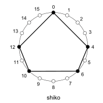                           |     | `A02`   | [Son](midi/son.mid)             | Fig. 6.2  | 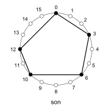             |
| `A03`   | [Soukous](midi/soukous.mid)                        | Fig. 7.4  | 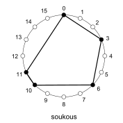                       |     | `A04`   | [Rumba](midi/rumba.mid)         | Fig. 7.3  | 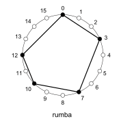         |
| `A05`   | [Bossa-nova](midi/bossa-nova.mid)                  | Fig. 7.6  | 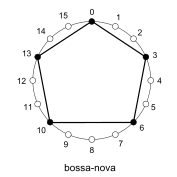                 |     | `A06`   | [Gahu](midi/gahu.mid)           | Fig. 7.5  | 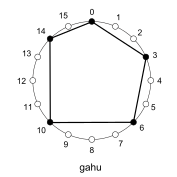           |
| `A07`   | [Fume-fume](midi/fume-fume.mid)                    | Fig. 10.1 | 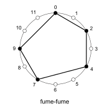                   |     | `A08`   | [Bembé](midi/bembe.mid)         | Fig. 10.2 | 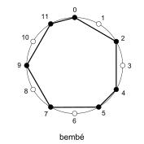         |
| `A09`   | [Classical ostinato](mid/classical%20ostinato.mid) | Fig. 13.4 | 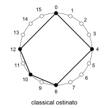 |     | `A10`   | [Tresillo](midi/tresilo.mid)    | Fig 14.4  | 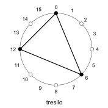     |
| `A11`   | [Cinquillo](midi/cinquillo.mid)                    | Fig. 14.6 | 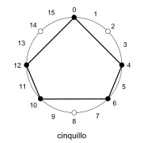                   |     | `A12`   | [Bangu](midi/bangu.mid)         | Fig 14.7  | 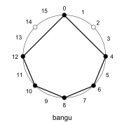         |
| `A13`   | [Standard pattern](midi/standard%20pattern.mid)    | Fig 14.9  |    |     | `A14`   | [Seguiriya](midi/seguiriya.mid) | Fig. 15.4 | 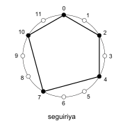 |
| `A15`   | [Tornada](midi/tornada.mid)                        | Fig. 15.5 | 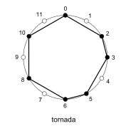                       |     | `A16`   | [Sorsonet](midi/sorsonet.mid)   | Fig 15.5  | 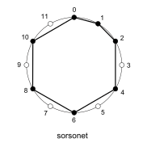   |

Other patterns
- [ ] aksak, `[2-2-2-3]`, Fig. 14.5

### `P05`: Twelve-tone cannon

*Performance:* for first four scenes, transition to next scene at measure 10; for fifth scene, transaction to sixth scene before measure 10.

- [MIDI worksheet](midi/twelve-tone%20cannon.mid)
- [audio](https://recorder.google.com/907e6e10-9eb9-4be9-b7e8-707febf18ad3)

| Scene | Description                                       | A     | B     | C     | D   |
| ----- | ------------------------------------------------- | ----- | ----- | ----- | --- |
| `S01` | Theme then inversion                              | `A01` | `B01` | `C03` | `-` |
| `S02` | Inversion then retrograde inversion               | `A01` | `B01` | `C04` |     |
| `S03` | Retrograde inversion then retrograde              | `A01` | `B01` | `C05` |     |
| `S04` | Retrograde then theme                             | `A01` | `B01` | `C06` |     |
| `S05` | Theme and inversion, then retrogrades, then theme | `A01` | `B01` | `C07` |     |
| `S06` | Same as `S05`, but silence at measure 10          | `A02` | `B02` | `C07` |     |

| Pattern | Description                                                                                                                                                        |
| ------- | ------------------------------------------------------------------------------------------------------------------------------------------------------------------ |
| `A01`   | Retrograde at standard pattern in four measures plus seguiriya in one measure                                                                                      |
| `A02`   | Same a `A01`, but silence at measure 5                                                                                                                             |
| `B01`   | Retrograde inversion at buleria in five measures twice                                                                                                             |
| `B02`   | Same as `B01`, but silence at measure 10                                                                                                                           |
| `C01`   | Theme, retrograde, inversion, retrograde inversion                                                                                                                 |
| `C02`   | Same as `C01`, but transposed to same range                                                                                                                        |
| `C03`   | Theme at standard pattern in four measures plus seguiriya in one measure; followed by inversion at soleà in two measures                                           |
| `C04`   | Inversion at standard pattern in four measures plus seguiriya in one measure; followed by retrograde inversion at soleà in two measures                            |
| `C05`   | Retrograde inversion at standard pattern in four measures plus seguiriya in one measure; follwed by retrograde at soleà in two measures                            |
| `C06`   | Retrograde at standard pattern in four measures plus seguiriya in one measure; followed by theme at soleà in two measures                                          |
| `C07`   | Theme and inversion together at standard pattern in four measures plus seguiria in one measure; followed by both retrogrades in the same rhythm; followed by theme |

### `P01`: Experiments

| Scene | Description                            | A     | B     | C     | D     |
| ----- | -------------------------------------- | ----- | ----- | ----- | ----- |
| `S01` | A plucking and industrial compositions | `A01` | `B01` | `C01` | `D01` |
| `S02` | Fractal of basic rhythms               | `A03` | `B03` | `C02` | `D02` |
| `S03` | Fractal of clave son                   | `A03` | `B04` | `C03` | `D03` |
| `S04` | Melody with clave son                  | `A05` | `-`   | `C04` | `-`   |

| Pattern | Description                       |
| ------- | --------------------------------- |
| `A01`   | Pluck and clap                    |
| `A03`   | Clave son, length 2               |
| `A05`   | Clave son, length 2 then length 1 |
| `B01`   | Base pizzicato                    |
| `B03`   | Clave shiko, length 3             |
| `B04`   | Clave son, length 3               |
| `C01`   | Plucked melody                    |
| `C02`   | Clave soukous, length 5           |
| `C03`   | Clave son, length 5               |
| `C04`   | Melody                            |
| `D01`   | Industrial beat                   |
| `D02`   | Clave gahu, length 7              |
| `D03`   | Clave son, length 7               |

## Reference

| Function           | Keys                                        |
| ------------------ | ------------------------------------------- |
| Time signature     | press `MAIN` + `TEMP` then turn `x` and `y` |
| Pattern length     | press `RECORD` then press `+` or `-`        |
| Select pattern     | hold group then press `+` or `-` or numbers |
| Erase pattern      | hold `ERASE` and group                      |
| Solo               | hold `FX` and groups                        |
| Play from start    | press `SHIFT` and `PLAY`                    |
| Repeat note        | hold `TIMING` and pad                       |
| Erase notes on pad | press `ERASE` and pad                       |

| Property | Scope   |
| -------- | ------- |
| Tempo    | Project |

## Resources

- Teenage Engineering
    - [Update utility](https://teenage.engineering/apps/update)
    - [Sample tool](https://teenage.engineering/apps/ep-sample-tool)
    - [EP-133 guide](https://teenage.engineering/guides/ep-133)
- Tools
    - [Signal](https://signal.vercel.app/) online MIDI editor
- Sheet music
    - [MuseScore](https://musescore.com/)
 - Tutorials
    - [Teenage engineering KO II EP-133 - Deep dive tutorial guide](https://youtu.be/czGfzmni7q4)
