# The geometry of musical rhythm

Toussaint, Godfried T. *[The Geometry of Musical Rhythm : What Makes a “Good” Rhythm Good?](https://search.worldcat.org/title/1112377436)* Second edition, CRC Press, Taylor & Francis Group, 2020.

- [Program](P07.tar)

## `A` Group

Signature: `6/4`

| Pattern | Name                                           | Reference | Timeline                                               |     | Pattern | Name                       | Reference | Timeline                           |
| ------- | ---------------------------------------------- | --------- | ------------------------------------------------------ | --- | ------- | -------------------------- | --------- | ---------------------------------- |
| `A01`   | [Shiko](shiko.mid)                             | Fig. 7.2  | 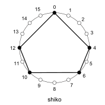                           |     | `A02`   | [Son](son.mid)             | Fig. 6.2  | 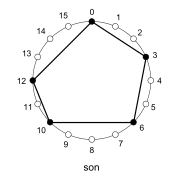           |
| `A03`   | [Soukous](soukous.mid)                         | Fig. 7.4  | 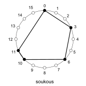                       |     | `A04`   | [Rumba](rumba.mid)         | Fig. 7.3  | 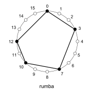       |
| `A05`   | [Bossa-nova](bossa-nova.mid)                   | Fig. 7.6  | 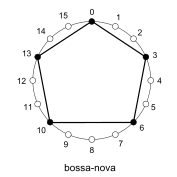                 |     | `A06`   | [Gahu](gahu.mid)           | Fig. 7.5  | 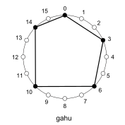         |
| `A07`   | [Fume-fume](fume-fume.mid)                     | Fig. 10.1 | 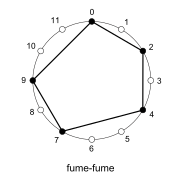                   |     | `A08`   | [Bembé](bembe.mid)         | Fig. 10.2 | 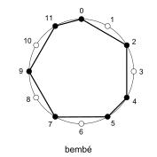       |
| `A09`   | [Classical ostinato](classical%20ostinato.mid) | Fig. 13.4 | 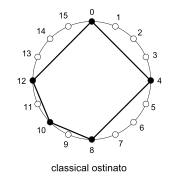 |     | `A10`   | [Tresillo](tresilo.mid)    | Fig. 14.4 | 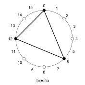   |
| `A11`   | [Cinquillo](cinquillo.mid)                     | Fig. 14.6 | 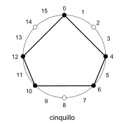                   |     | `A12`   | [Bangu](bangu.mid)         | Fig. 14.7 | 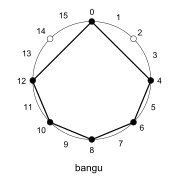       |
| `A13`   | [Standard pattern](standard%20pattern.mid)     | Fig. 14.9 |    |     | `A14`   | Aksak                      | Fig. 14.5 | `[2-2-2-3]`                        |
| `A15`   | [Tornada](tornada.mid)                         | Fig. 15.5 | 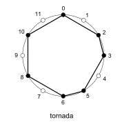                       |     | `A16`   | [Sorsonet](sorsonet.mid)   | Fig. 15.5 | 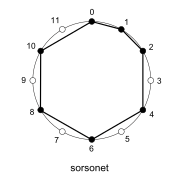 |
| `A17`   | Fandango                                       | Fig. 16.9 | `[3-3-3-3]`                                            |     | `A18`   | Guajira                    | Fig. 16.9 | `[3-3-2-2-2]`                      |
| `A19`   | [Seguiriya](seguiriya.mid)                     | Fig. 15.4 | 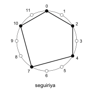                   |     | `A20`   | Buleria                    | Fig. 16.9 | `@2 [4-1-2-2-3]`                   |
| `A21`   | Soleá                                          | Fig. 16.9 | `@2 [3-2-2-2-3]`                                       |     | `A22`   | Bembé shekere              | Fig. 17.3 | `[2-1-2-1-1-2-1-1-1]`              |

Other patterns

- [ ] aksak, `[2-2-2-3]`, Fig. 14.5

## `B` Group

Signature: `4/4`

Figure 18.6

| Number | Name           |  0 |  1 |  2 |  3 |  4 |  5 |  6 |  7 |  8 |  9 | 10 | 11 | 12 | 13 | 14 | 15 |
|-------:|:---------------|:--:|:--:|:--:|:--:|:--:|:--:|:--:|:--:|:--:|:--:|:--:|:--:|:--:|:--:|:--:|:--:|
|      1 | Bossa-1        |  ■ |    |    |  ■ |    |    |  ■ |    |    |    |  ■ |    |    |  ■ |    |    |
|      2 | Bossa-2        |  ■ |    |    |  ■ |    |    |  ■ |    |    |  ■ |    |    |  ■ |    |    |    |
|      3 | Bossa-3        |  ■ |    |    |  ■ |    |    |  ■ |    |    |  ■ |    |    |    |  ■ |    |    |
|      4 | Shiko          |  ■ |    |    |    |  ■ |    |  ■ |    |    |    |  ■ |    |  ■ |    |    |    |
|      5 | Timini         |  ■ |    |  ■ |    |    |    |  ■ |    |  ■ |    |    |    |  ■ |    |    |    |
|      6 | Kromanti       |  ■ |    |  ■ |    |    |    |  ■ |    |    |    |  ■ |    |  ■ |    |    |    |
|      7 | Tuareg         |  ■ |    |    |    |  ■ |    |  ■ |    |  ■ |    |    |    |  ■ |    |    |    |
|      8 | Tipitina       |  ■ |    |  ■ |    |  ■ |    |    |    |    |  ■ |    |    |    |    |  ■ |    |
|      9 | Son            |  ■ |    |    |  ■ |    |    |  ■ |    |    |    |  ■ |    |  ■ |    |    |    |
|     10 | Rumba          |  ■ |    |    |  ■ |    |    |    |  ■ |    |    |  ■ |    |  ■ |    |    |    |
|     11 | Gahu           |  ■ |    |    |  ■ |    |    |  ■ |    |    |    |  ■ |    |    |    |  ■ |    |
|     12 | Domba          |  ■ |    |  ■ |    |    |  ■ |    |    |    |  ■ |    |    |    |  ■ |    |    |
|     13 | Kpatsa         |  ■ |    |    |    |  ■ |    |    |    |  ■ |    |    |  ■ |    |  ■ |    |    |
|     14 | Rap-X          |  ■ |    |    |    |  ■ |    |    |  ■ |    |  ■ |    |    |  ■ |    |    |    |
|     15 | Soukous        |  ■ |    |    |  ■ |    |    |  ■ |    |    |    |  ■ |  ■ |    |    |    |    |
|     16 | Rap-2          |  ■ |    |  ■ |    |    |    |    |  ■ |    |    |  ■ |    |    |    |  ■ |    |
|     17 | Mambo-1        |  ■ |    |    |  ■ |    |  ■ |    |    |  ■ |    |  ■ |    |    |  ■ |    |    |
|     18 | Mambo-2        |  ■ |    |  ■ |    |    |  ■ |    |    |  ■ |    |    |  ■ |    |  ■ |    |    |
|     19 | R-W-B          |  ■ |    |  ■ |    |    |  ■ |    |    |  ■ |    |    |  ■ |    |    |  ■ |    |
|     20 | Popcorn        |  ■ |    |  ■ |    |  ■ |    |    |  ■ |    |  ■ |    |    |    |    |  ■ |    |
|     21 | Funky          |  ■ |    |  ■ |    |  ■ |    |    |  ■ |    |  ■ |    |    |  ■ |    |    |    |
|     22 | Central-Africa |  ■ |    |  ■ |    |  ■ |    |  ■ |    |  ■ |    |    |  ■ |    |    |  ■ |    |
|     23 | Takoe          |  ■ |    |    |  ■ |    |  ■ |    |    |  ■ |    |  ■ |    |  ■ |    |  ■ |    |
|     24 | Akom           |  ■ |    |  ■ |    |  ■ |    |  ■ |    |    |  ■ |    |  ■ |    |    |  ■ |    |
|     25 | Adangme        |  ■ |    |  ■ |    |  ■ |    |  ■ |    |  ■ |    |    |  ■ |    |  ■ |    |    |
|     26 | Samba          |  ■ |    |  ■ |    |    |  ■ |    |  ■ |    |  ■ |    |    |  ■ |    |  ■ |    |
|     27 | Ghana          |  ■ |    |  ■ |    |  ■ |    |  ■ |    |    |  ■ |    |  ■ |    |  ■ |    |    |
|     28 | Bembe-duple    |  ■ |    |    |  ■ |    |    |  ■ |  ■ |    |    |  ■ |    |  ■ |    |    |  ■ |
|     29 | Oyaa           |  ■ |    |  ■ |    |  ■ |    |  ■ |    |  ■ |    |  ■ |  ■ |    |  ■ |  ■ |    |
|     30 | Ngbaka         |  ■ |    |  ■ |    |  ■ |    |  ■ |  ■ |    |  ■ |    |  ■ |    |  ■ |  ■ |    |
|     31 | Ngbaka-Maibo   |  ■ |    |  ■ |    |  ■ |    |  ■ |  ■ |    |  ■ |    |  ■ |    |  ■ |    |  ■ |
|     32 | Kassa          |  ■ |  ■ |    |  ■ |    |  ■ |  ■ |    |  ■ |    |  ■ |    |  ■ |    |  ■ |    |
|     33 | Mutuashi       |  ■ |  ■ |    |  ■ |    |  ■ |    |  ■ |  ■ |    |  ■ |    |  ■ |    |  ■ |    |
|     34 | Rumba-palitos  |  ■ |    |  ■ |  ■ |    |  ■ |    |  ■ |  ■ |    |  ■ |    |  ■ |  ■ |    |  ■ |

## Pads

|       | `A` Pads |       |     |       | `B` Pads |       |     |       | `C` Pads |       |     |       | `D` Pads |       |
| :---: | :------: | :---: | :-: | :---: | :------: | :---: | :-: | :---: | :------: | :---: | :-: | :---: | :------: | :---: |
| `---` |  `---`   | `---` |     | `---` |  `---`   | `---` |     | `---` |  `---`   | `---` |     | `---` |  `---`   | `---` |
| `---` |  `100`   | `---` |     | `---` |  `145`   | `---` |     | `---` |  `---`   | `---` |     | `---` |  `---`   | `---` |
| `---` |  `---`   | `---` |     | `---` |  `---`   | `---` |     | `---` |  `412`   | `---` |     | `---` |  `---`   | `---` |
| `---` |  `---`   | `---` |     | `---` |  `---`   | `---` |     | `---` |  `---`   | `---` |     | `---` |  `---`   | `---` |
